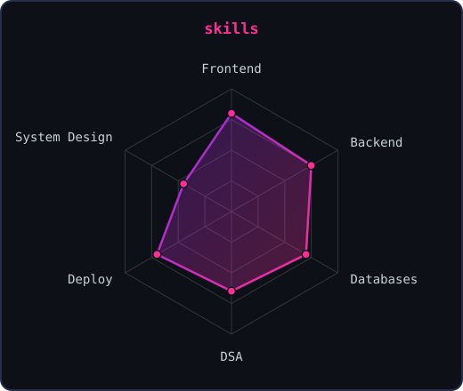
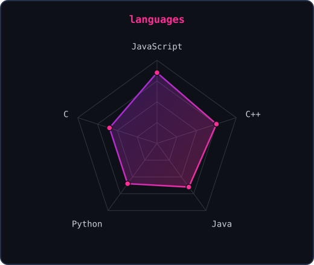
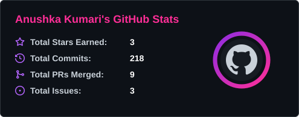
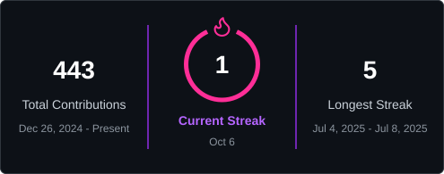
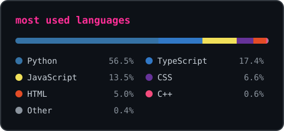

<!-- BANNER - terminal profile.sh --live. Generated by scripts/build_assets.py from assets/profile.json -->
<picture>
  <source media="(prefers-color-scheme: dark)"  srcset="assets/banner-dark.svg">
  <source media="(prefers-color-scheme: light)" srcset="assets/banner-light.svg">
  
</picture>

 

<!-- NAME / TAGLINE - animated typing -->

 

---

## 👩‍💻 &nbsp;This is me :)

- 🚀 I build **end-to-end web apps**, from the React front end all the way down to the API, the database and the deploy.
- 🧠 I like the unglamorous stuff too: **operating systems, DSA, DBMS and computer networks**.
- 🌐 Most of my projects ship **live**, not just to `main`. Vercel + Render are my happy places.
- 🤝 Open to **collaborations, open source and internships**.
- 📫 Reach me at **anushkaa22kumari@gmail.com**

 

## 🛠️ &nbsp;my stack

---

## 📡 &nbsp;signals

<table>
<tr>
<td width="50%" align="center" valign="middle">

<!-- Self-rated radar - edit assets/profile.json, then run scripts/build_assets.py -->
<picture>
  <source media="(prefers-color-scheme: dark)"  srcset="assets/radar-dark.svg">
  <source media="(prefers-color-scheme: light)" srcset="assets/radar-light.svg">
  
</picture>

</td>
<td width="50%" align="center" valign="middle">

<picture>
  <source media="(prefers-color-scheme: dark)"  srcset="assets/radar-languages-dark.svg">
  <source media="(prefers-color-scheme: light)" srcset="assets/radar-languages-light.svg">
  
</picture>

</td>
</tr>
</table>

---

## 📊 &nbsp;numbers matter? ohhh yes.

<table>
<tr>
<td width="50%" align="center" valign="middle">

<!-- Refreshed every 3h by .github/workflows/refresh-stats.yml (scripts/build_stats.py) -->
<picture>
  <source media="(prefers-color-scheme: dark)"  srcset="assets/stats-dark.svg">
  <source media="(prefers-color-scheme: light)" srcset="assets/stats-light.svg">
  
</picture>

</td>
<td width="50%" align="center" valign="middle">

<!-- Refreshed every 3h by .github/workflows/refresh-stats.yml (scripts/build_stats.py) -->
<picture>
  <source media="(prefers-color-scheme: dark)"  srcset="assets/streak-dark.svg">
  <source media="(prefers-color-scheme: light)" srcset="assets/streak-light.svg">
  
</picture>

</td>
</tr>
</table>

 

<!-- Generated by scripts/build_languages.py from your repos (no third-party widget) -->
<picture>
  <source media="(prefers-color-scheme: dark)"  srcset="assets/languages-dark.svg">
  <source media="(prefers-color-scheme: light)" srcset="assets/languages-light.svg">
  
</picture>

---

## 💡 &nbsp;currently

| 🔭 Building | 👯 Open to | ⚡ Fun fact |
|:---:|:---:|:---:|
| Full-stack MERN + Next.js apps, learning system design & scalable backends | Collabs, open source, internships | I ship to production before I write the README |

 

## 💜 &nbsp;let's build something

  

**⭐ If a project here helped you, a star means a lot.**

